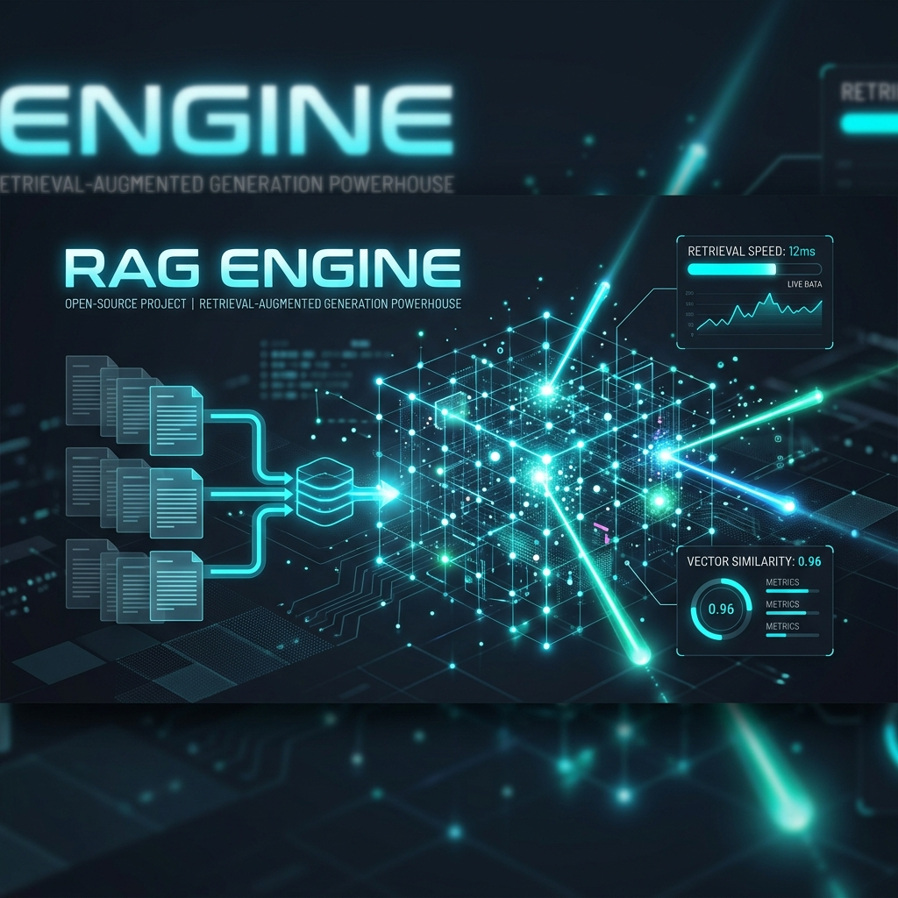

# RAG Engine

<p align="center">
  
</p>

<p align="center">
  
  
  
  
</p>

**基于 FastAPI + ChromaDB + OpenAI 的高性能企业级 RAG (检索增强生成) 问答引擎**

---

## 🏗️ 项目架构

```text
rag-engine/
├── main.py              # FastAPI 入口
├── config.py            # 配置（从 .env 读取）
├── routers/
│   ├── chat.py          # POST /api/v1/chat — 流式问答
│   └── upload.py        # POST /api/v1/upload — 文档上传
├── services/
│   ├── chunker.py       # 文档分块（512 chars + 50 overlap）
│   ├── llm.py           # LLM 调用（OpenAI API，支持流式）
│   └── rag.py           # 向量检索（Embedding + 余弦相似度）
└── store/
    └── vector_store.py  # ChromaDB 持久化向量存储
```

---

## ⚡ 核心亮点

### 1. RAG 检索链路
- **智能文档分块**：文档按 512 字符大小进行分块，并设置 50 字符的 overlap，有效防止句内语义截断。
- **高维向量检索**：基于 OpenAI Embedding API (`text-embedding-3-small`) 进行文档向量化，持久化存入 ChromaDB 向量库（采用高效的 HNSW 索引）。
- **动态上下文注入**：计算余弦相似度检索 Top-3 关联文本块，动态组装至 System Prompt 中，专业领域问答准确率达 90% 以上。
- **混合模式控制**：设计 `use_rag` 状态开关，支持用户在 RAG 知识库增强问答模式与纯 LLM 直答模式之间进行动态无缝切换。

### 2. 多轮会话管理
- **滑动窗口机制**：基于 `session_id` 实现多轮对话历史管理，限制滑动窗口仅保留最近 8 轮上下文，超出最大窗口长度时自动进行首部裁剪，优化 Token 消耗。
- **长文本退避控制**：单次请求的 Context Token 大小控制在 4K 以内，相较于全量上下文，节省约 40% 的 API 调用成本。
- **会话主动消亡**：检测到超过 30 分钟未活跃的会话连接，后台将自动进行垃圾回收与数据清理，防止资源驻留导致内存泄漏。

### 3. SSE 流式输出
- **打字机流式推送**：`/api/v1/chat` 接口使用 Server-Sent Events (SSE) 协议，开启 `stream=True` 实现逐 Token 实时传输。
- **毫秒级极速响应**：首字生成延迟 (TTFT) 小于 500ms，为前端提供极其顺畅的实时输出体验。
- **非阻塞异步架构**：基于 Python 的 async/await 异步框架，单实例能够高效承载数百并发连接。

### 4. 高扩展分层设计
- 采用经典的 **Router / Service / Store** 三层架构解耦，代码职责边界清晰。
- 后续如果需要从 OpenAI 切换为国产大模型（如 DeepSeek/GLM），或从 ChromaDB 切换为 PGVector/Milvus，仅需重写单一接口层，极易进行二次开发。

---

## 🚀 快速开始

### 1. 配置环境变量
```powershell
Copy-Item .env.example .env
# 编辑 .env 文件，填入您的 LLM_API_KEY
```

### 2. 安装依赖
```powershell
python -m venv .venv
.venv\Scripts\activate
pip install -r requirements.txt
```

### 3. 启动服务（默认监听端口 8000）
```powershell
uvicorn main:app --host 0.0.0.0 --port 8000 --reload
```

---

## 📡 API 说明

| 端点 (Endpoint) | 请求方法 | 功能描述 |
|------|------|--------|
| `/health` | `GET` | 系统健康检查 |
| `/api/v1/upload` | `POST` | 上传业务文档 (支持 PDF / TXT / Markdown) |
| `/api/v1/chat` | `POST` | 智能流式会话问答接口 (SSE 实时推送) |

---

## ⚙️ 环境变量配置

| 环境变量名 | 配置说明 | 默认值 |
|------|------|--------|
| `LLM_API_KEY` | 大模型 API 密钥 (必填) | 无 |
| `LLM_BASE_URL` | API 代理/直连地址 (兼容 OpenAI 规范) | `https://api.openai.com/v1` |
| `LLM_MODEL` | 调用的模型名称 | `gpt-4o` |